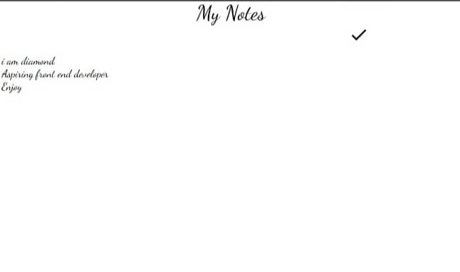

# Notepad
## About 
A clean, minimalist notepad built from scratch. No frills, just functionality. I didn’t just take notes — I coded them, bringing simplicity and freedom to your thoughts.
## Contribution 
Contributions are always welcome! If you'd like to contribute, feel free to fork the repository, make your changes, and submit a pull request. Please ensure your code follows best practices and is well-documented.
## Preview

## Languages Used
Html
Css
Javascript(Vanilla)
## Cloning
If you want to clone to Your desktop locally here's the link https://github.com/diamond-commit/Notepad.git
### If you think it's a W project then please star this repository.

